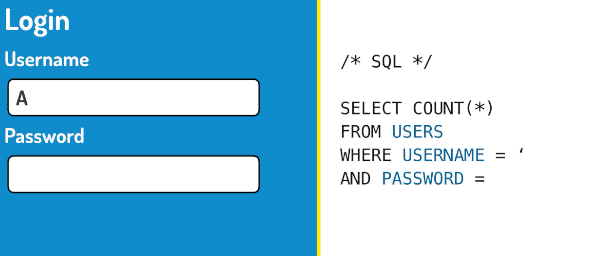
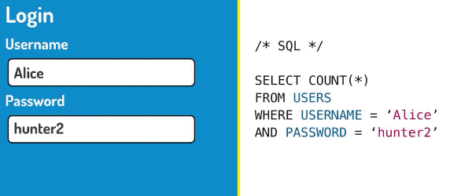
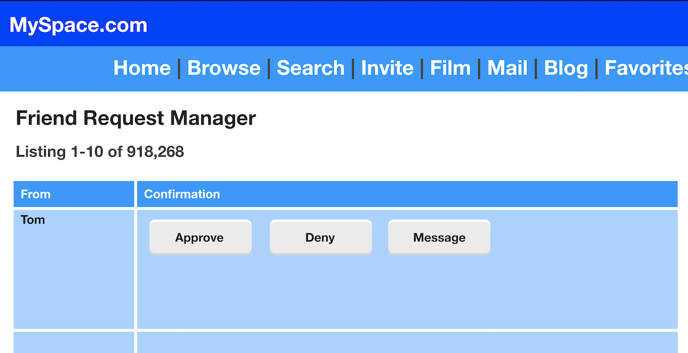
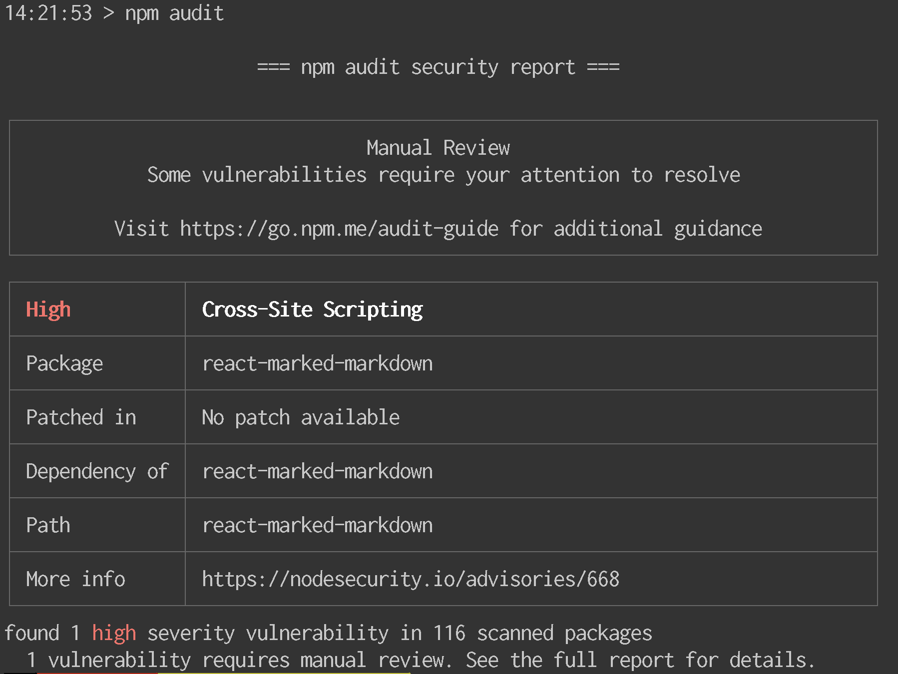

# Securing your site like it's 1999
Running a website in the early years of the web was a scary business. The web was an evolving medium, and people were finding new uses for it almost every day. From [book stores](https://www.amazon.com/) to [online auctions](https://www.ebay.com/), the web was an expanding universe of new possibilities.

As the web evolved, so too did the knowledge of its inherent security vulnerabilities. Clever tricks that were played on one site could be copied on literally hundreds of other sites. It was a normal sight to log in to a website to find nothing working because someone had breached its defences and deleted its database. Lessons in web security in those days were hard-earned.

What follows are examples of critical mistakes that brought down several early websites, and how you can help protect yourself and your team from the same fate.

## Bad input validation: Trusting anything the user sends you
Our story begins in the most unlikely place: [Animal Crossing](https://en.wikipedia.org/wiki/Animal_Crossing). Animal Crossing was a 2001 video game set in a quaint town, filled with happy-go-lucky inhabitants that co-exist peacefully. Like most video games, Animal Crossing was the subject of many fan communities on the early web.

One such unofficial [web forum](https://en.wikipedia.org/wiki/Internet_forum) was dedicated to players discussing their adventures in Animal Crossing. Players could trade secrets, ask for help, and share pictures of their virtual homes. This might sound like a model community to you, but _you would be wrong_.

One day, a player discovered a [hidden field](https://developer.mozilla.org/en-US/docs/Web/HTML/Element/input/hidden) in the forum's user profile form. Normally, this page allows users to change their name, their password, or their profile photo. This person discovered that the hidden field contained their unique user ID, which identifies them when the forum's backend saves profile changes to its database. They discovered that by modifying the form to change the user ID, they could make changes to _any other player's profile_.

Needless to say, this idyllic online community descended into chaos. Users changed each other's passwords, deleted each other's messages, and attacked each-other under the cover of complete anonymity. What happened?

There aren't any official rules for developing software on the web. But if there were, my golden rule would be:

**Never trust user input. Ever.**

Always ask yourself how users will send you data that isn't what it seems to be. If the nicest community of gamers playing the happiest game on earth can turn on each other, nowhere on the web is safe.

<!-- TODO: Insert escaping link: https://www.owasp.org/index.php/XSS_(Cross_Site_Scripting)_Prevention_Cheat_Sheet#RULE_.231_-_HTML_Escape_Before_Inserting_Untrusted_Data_into_HTML_Element_Content  -->
Make sure you validate user input to make sure it's of the correct _type_ (e.g. string, number, JSON string) and that it's the _length_ that you were expecting. Don't forget that user input doesn't become _safe_ once it is stored in your database; any data that originates from outside your network can still be dangerous and [must be escaped]() before it is inserted into HTML.

Make sure to check a user's actions against what they are allowed to do. Create a clear [access control policy](https://www.owasp.org/index.php/Access_Control_Cheat_Sheet) that defines what actions a user may take, and to whose data they are allowed access to. For example, a newly-registered user should not be allowed to change the user profile of a web forum's owner.

Finally, never rely on client-side validation. Validating user input in the browser is a convenience to the user, not a security measure. Always assume the user has full control over any data sent from the browser and **make sure you validate any data sent to your backend from the outside world**.

## SQL injection: Allowing the user to run their own database queries
A long time ago, my favourite website was a web forum dedicated to the [Final Fantasy video game series](https://en.wikipedia.org/wiki/Final_Fantasy). Like the users of the _Animal Crossing_ forum, I'd while away many hours [arguing with other people on the internet](https://xkcd.com/386/) about my favourite characters, my favourite stories, and the [greatest controversies of the day](https://www.youtube.com/watch?v=KQc7o2rm7po).

One day, I noticed people were acting strangely. Users were being uncharacteristically nasty and posting in private areas of the forum they wouldn't normally have access to. Then messages started disappearing, and user accounts for well-respected people were banned.

It turns out someone had discovered a way of logging in to any other user account, using a secret password that allowed them to do literally anything they wanted. What was this password that granted untold power to those who wielded it?

`' OR '1'='1`
<!-- TODO: Insert screenshot of a login form -->

[SQL](https://en.wikipedia.org/wiki/SQL) is a computer language that is used to query databases. When you fill out a login form, just like the one above, your username and your password are usually inserted into an SQL query like this:


```
SELECT COUNT(*)
FROM USERS
WHERE USERNAME='Alice'
AND PASSWORD='hunter2'
```

This query selects users from the database that match the username _Alice_ and the password _hunter2_. If there is at least one user matching record, the user will be granted access. Let's see what happens when we use our magic password instead!


```
SELECT COUNT(*)
FROM USERS
WHERE USERNAME='Admin'
AND PASSWORD='' OR '1'='1'
```

Does the password look like part of the query to you? That's because it is! This password is a deliberate attempt to inject our own SQL into the query, hence the term _SQL injection_. The query is now looking for users matching the username _Admin_, with a password that is blank, or _1=1_. In an SQL query, _1=1_ is always _true_, which makes this query select _every single record_ in the database. As long as the forum software is checking for _at least one_ matching user, it will grant the person logging in access. This password will work for _any user registered on the forum!_

So how can you protect yourself from SQL injection?

Never build SQL queries by [concatenating strings](https://en.wikipedia.org/wiki/Concatenation). Instead, use parameterised query tools. PHP offers [prepared statements](http://php.net/manual/en/pdo.prepared-statements.php), and Node.JS has the [knex](http://npmjs.com/package/knex) package. Alternatively, you can use an [ORM](https://en.wikipedia.org/wiki/Object-relational_mapping) tool, such as [Propel](http://propelorm.org/) or [sequelize](https://www.npmjs.com/package/sequelize).

Expert help in the form of language features or software tools is a key ally for securing your code. Get all the help you can!

## Cross site request forgery: Getting other users to do your dirty work for you
Do you remember Netflix? Not the Netflix we have now, the Netflix that used to [rent you DVDs by mailing them to you](https://www.youtube.com/watch?v=mCEkFkvt7EQ). My next story is about how someone managed to convince Netflix users to send him their DVDs - free of charge.

Have you ever clicked on a hyperlink, only to [find something that you weren't expecting?](https://youtu.be/dQw4w9WgXcQ) If you were lucky, you might have just gotten Rickrolled. If you were unlucky...

Let's just say there are older and fouler things than Rick Astley in the dark places of the web.

What if you could convince people to visit a page you controlled? And what if those people were Netflix users, and they were logged in? In 2006, [Dave Ferguson did just that](https://appsecnotes.blogspot.com/2009/01/netflix-csrf-revisited.html). He created a harmless-looking page with an image on it:

```

```

Did you notice the source URL of the image? It's deliberately crafted to add a particular DVD to your queue. Sprinkle in a few more requests to change the user's name and shipping address, and you could ship yourself DVDs _completely free of charge!_

This attack is possible when websites unconditionally trust a user's session [cookies](https://developer.mozilla.org/en-US/docs/Web/HTTP/Cookies) without checking where HTTP requests come from.

The first check you can make is to verify that a request's [origin](https://developer.mozilla.org/en-US/docs/Web/HTTP/Headers/Origin) and [referer](https://developer.mozilla.org/en-US/docs/Web/HTTP/Headers/Referer) headers match the location of the website. These headers can't be programmatically set.

<!-- TODO: Add OWASP tokens link -->
<!-- https://www.owasp.org/index.php/Cross-Site_Request_Forgery_(CSRF)_Prevention_Cheat_Sheet#Synchronizer_Token_Pattern-->
Another check you can use is to add [CSRF tokens]() to your web forms, to verify requests have come from an actual form on your website. Tokens are long, unpredictable, unique strings that are generated by your server and inserted into web forms. When users complete a form, the form data sent to the server can be checked for a recently generated token. This is an effective deterrent of CSRF attacks because synchroniser tokens aren't stored in cookies.

You can also set `SameSite=Strict` when setting cookies with the [Set-Cookie HTTP header](https://developer.mozilla.org/en-US/docs/Web/HTTP/Headers/Set-Cookie). This communicates to browsers that cookies are not to be sent with cross-site requests. This is a relatively new feature, though it is [well supported](https://caniuse.com/#feat=same-site-cookie-attribute) in evergreen browsers.

## Cross site scripting: Someone else's code running on your website
In 2005, Samy Kamkar became famous for [having lots of friends](https://samy.pl/myspace/). Lots and lots of friends.

Samy enjoyed using MySpace which, at the time, was the world's largest social network. Social networks at that time were more limited than today. For instance, MySpace let you upload photos to your photo gallery, but capped the limit at twelve. Twelve photos. At least you didn't have to wade through photos of avocado toast back then...

Samy discovered that MySpace also locked down the kinds of content that you could post on your MySpace page. He discovered he could inject `` and `<div />` tags into his headline, but `<script />` was filtered. MySpace wasn't about to let someone else run their own code on MySpace.

Intrigued, Samy set about finding out exactly what he could do with `` and `<div />` tags. He found that you could add style properties to `<div />` tags to style them with CSS.

```
<div style="background:url('javascript:alert(1)')">
```

This code only worked in Internet Explorer and in some versions of Safari, but that was plenty of people to befriend. However, MySpace was prepared for this: they also filtered the word `javascript` from `<div />`.

```
<div style="background:url('java
script:alert(1)')">
```

Samy discovered that by inserting a line break into his code, MySpace would not filter out the word _javascript_. The browser would continue to run the code _just fine_! Samy had now broken past MySpace's first line of defence and was able to start running code on his profile page. Now he started looking at _what he could do with that code_.

```
alert(document.body.innerHTML)
```

Samy wondered if he could inspect the page's source to find the details of other MySpace users to befriend. To do this, you would normally use `document.body.innerHTML`, but MySpace had filtered this too.

```
alert(eval('document.body.inne' + 'rHTML'))
```

This isn't a problem if you build up JavaScript code inside a string and execute it using the `eval()` function. This trick also worked with `XMLHttpRequest.onReadyStateChange`, which allowed Samy to send friend requests to the MySpace API and install the JavaScript code on his new friends' pages.

One final obstacle stood in his way. The [same origin policy](https://developer.mozilla.org/en-US/docs/Web/Security/Same-origin_policy) is a security mechanism that prevents scripts hosted on one domain interacting with sites hosted on another domain.

```
if (location.hostname == 'profile.myspace.com') {
  document.location = 'http://www.myspace.com'
  + location.pathname + location.search
}
```

Samy discovered that only the `http://www.myspace.com` domain would accept his API requests, and requests from `http://profile.myspace.com` were being blocked by the browser's same-origin policy. By redirecting the browser to `http://www.myspace.com`, he discovered that he could load profile pages _and successfully make requests to MySpace's API_. Samy installed this code on his profile page, and he waited.



Over the course of the next day, over a million people unwittingly installed Samy's code into their MySpace profile pages and invited their friends. The load of friend requests on MySpace was so large that the site buckled and shut down. It took them two hours to remove Samy's code and patch the security holes he exploited. Samy was raided by the United States secret service and sentenced to do 90 days of community service.

This is the power of installing a little bit of JavaScript on someone else's website. It is called cross site scripting, and its effects can be devastating. It is suspected that cross-site scripting was to blame for the [2018 British Airways breach](https://www.wired.com/story/british-airways-hack-details/) that leaked the credit card details of 380,000 people.

So how can you help protect yourself from cross-site scripting?

Always sanitise user input when it comes in, using a library such as [sanitize-html](https://www.npmjs.com/package/sanitize-html). Open source tools like this benefit from hundreds of hours of work from dozens of experienced contributors. Don't be tempted to roll your own protection. MySpace was prepared, but they were not prepared enough. It makes no sense to turn this kind of help down.

You can also use an auto-escaping templating language to make sure nobody else's HTML can get into your pages. Both [Angular](https://angular.io/) and [React](https://reactjs.org/) will do this for you, and they are extremely convenient to use.

You should also implement a [content security policy](https://developer.mozilla.org/en-US/docs/Web/HTTP/CSP) to restrict the domains that content like scripts and stylesheets can be loaded from. Loading content from sites not under your control is a significant security risk, and you should use a CSP to lock this down to only the sources you trust. CSP can also block the use of the `eval()` function.

For content not under your control, consider setting up [sub-resource integrity](https://developer.mozilla.org/en-US/docs/Web/Security/Subresource_Integrity) protection. This allows you to add hashes to stylesheets and scripts you include on your website. Hashes are like fingerprints for digital files; if the content changes, so does the fingerprint. Adding hashes will allow your browser to keep your site safe if the content changes without you knowing.

## npm audit: Protecting yourself from code you don't own
JavaScript and npm run the modern web. Together, they make it easy to take advantage of the world's largest public registry of open source software. How do you protect yourself from code written by someone you've never met? Enter [npm audit](https://blog.npmjs.org/post/173719309445/npm-audit-identify-and-fix-insecure).

npm audit reviews the security of your website's dependency tree. You can start using it by upgrading to the latest version of npm:

```
npm install npm -g
npm audit
```

When you run `npm audit`, npm submits a description of your dependencies to the Registry, which returns a report of known vulnerabilities for the packages you have installed.



If your website has a known cross-site scripting vulnerability, npm audit will tell you about it. What's more, if the vulnerability has been patched, running `npm audit fix` will automatically install the patched package for you!

## Securing your site like it's 2019
The truth is that since the early days of the web, the stakes of a security breach have become much, much higher. The web is so much more than fandom and mailing DVDs - online banking is now mainstream, social media and dating websites store intimate information about our personal lives, and we are even [inviting the internet into our homes](https://en.wikipedia.org/wiki/Internet_of_things).

However, we have powerful new allies helping us stay safe. There are more resources than ever before to teach us how to write secure code. Tools like [Angular](https://angular.io/) and [React](https://reactjs.org/) are designed with security features baked-in from the start. We have a new generation of security tools like [npm audit](https://blog.npmjs.org/post/173719309445/npm-audit-identify-and-fix-insecure) to watch over our dependencies.

As we roll over into 2019, let's take the opportunity to reflect on the security of the code we write and be grateful for the everything we've learned in the last twenty years.
